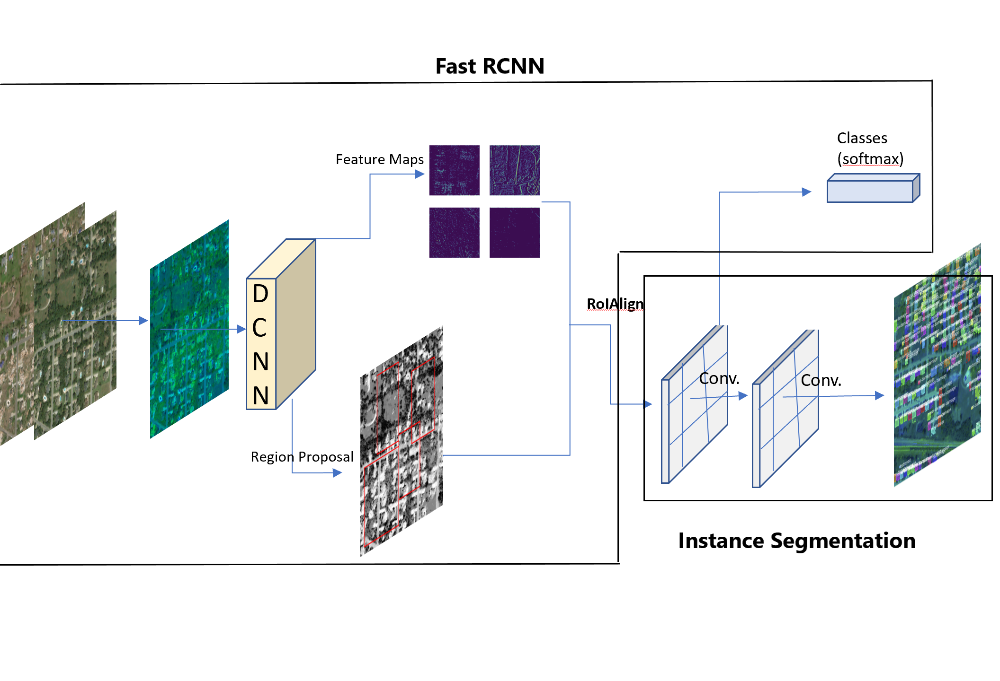

# Mask R-CNN for Object Detection and Segmentation

Original repository author : Waleed Abdulla

This is an implementation of [Mask R-CNN](https://arxiv.org/abs/1703.06870) on Python 3, Keras, and TensorFlow. The model generates bounding boxes and segmentation masks for each instance of an object in the image. It's based on Feature Pyramid Network (FPN) and a ResNet101 backbone.



The repository includes:
* Source code of Mask R-CNN built on FPN and ResNet101.
* Training code for MS COCO
* Jupyter notebooks to visualize and creating dataset.
* ParallelModel class for multi-GPU training
* Evaluation on MS COCO metrics (AP/F1)

## Requirements
Python 3.6, TensorFlow 1.14, Keras 2.2.5 and other common packages listed in `requirements.txt`.

### MS COCO Requirements:

To train or test on MS COCO, you'll also need:
* pycocotools (installation instructions below)
* Cython


## Installation
1. Clone this repository
2. Install dependencies
   ```bash
   pip3 install -r requirements.txt
   ```
3. Run setup from the repository root directory
    ```bash
    python3 setup.py install
    ``` 
3. Download pre-trained COCO weights (mask_rcnn_coco.h5) from the [releases page](https://github.com/matterport/Mask_RCNN/releases).
4. (Optional) To train or test on MS COCO install `pycocotools` from one of these repos. They are forks of the original pycocotools with fixes for Python3 and Windows (the official repo doesn't seem to be active anymore).

    * Linux: https://github.com/waleedka/coco
    * Windows: https://github.com/philferriere/cocoapi.
    You must have the Visual C++ 2015 build tools on your path (see the repo for additional details)

# Getting Started
* [debug.ipynb](samples/debug.ipynb) This file is used to understand the mask generation.

* [inspect_damage_assessment.ipynb](samples/inspect_damage_assessment.ipynb) This notebook combines the pre- & post- images and creates damage annotations

* ([model.py](mrcnn/model.py), [utils.py](mrcnn/utils.py), [config.py](mrcnn/config.py)): These files contain the main Mask RCNN implementation.


* [test_images.ipynb](samples/coco/test_images.ipynb). This notebook visualizes the test detection and metrics evaluation.


# Training on MS COCO

We train the initial model for building detection using the pretrained weights and use the updated weight for damage level detection.

Training code is in `samples/coco.py`. You can import this
module in Jupyter notebook (see the provided notebooks for examples) or you
can run it directly from the command line as such:

```


# Continue training a model that you had trained earlier
python3 samples/coco/coco.py train --dataset=/path/to/coco/ --model=/path/to/weights.h5

# Continue training the last model you trained. This will find
# the last trained weights in the model directory.
python3 samples/coco/coco.py train --dataset=/path/to/coco/ --model=last
```

The training schedule, learning rate, and other parameters should be set in `samples/coco.py` or mrcnn/config.py


In summary, to train the model on your own dataset you'll need to extend two classes:

```Config```
This class contains the default configuration. Subclass it and modify the attributes you need to change.

```Dataset```
This class provides a consistent way to work with any dataset. 
It allows you to use new datasets for training without having to change 
the code of the model. It also supports loading multiple datasets at the
same time, which is useful if the objects you want to detect are not 
all available in one dataset. 


## Differences from the Official Paper
This implementation follows the Mask RCNN paper for the most part, but there are a few cases where we deviated in favor of code simplicity and generalization. These are some of the differences we're aware of. If you encounter other differences, please do let us know.

* **Image Resizing:** To support training multiple images per batch we resize all images to the same size. For example, 1024x1024px on MS COCO. We preserve the aspect ratio, so if an image is not square we pad it with zeros. In the paper the resizing is done such that the smallest side is 800px and the largest is trimmed at 1000px.
* **Bounding Boxes**: Some datasets provide bounding boxes and some provide masks only. To support training on multiple datasets we opted to ignore the bounding boxes that come with the dataset and generate them on the fly instead. We pick the smallest box that encapsulates all the pixels of the mask as the bounding box. This simplifies the implementation and also makes it easy to apply image augmentations that would otherwise be harder to apply to bounding boxes, such as image rotation.

    To validate this approach, we compared our computed bounding boxes to those provided by the COCO dataset.
We found that ~2% of bounding boxes differed by 1px or more, ~0.05% differed by 5px or more, 
and only 0.01% differed by 10px or more.

* **Learning Rate:** The paper uses a learning rate of 0.02, but we found that to be
too high, and often causes the weights to explode, especially when using a small batch
size. It might be related to differences between how Caffe and TensorFlow compute 
gradients (sum vs mean across batches and GPUs). Or, maybe the official model uses gradient
clipping to avoid this issue. We do use gradient clipping, but don't set it too aggressively.
We found that smaller learning rates converge faster anyway so we go with that.

## Citation

```
@misc{matterport_maskrcnn_2017,
  title={Mask R-CNN for object detection and instance segmentation on Keras and TensorFlow},
  author={Waleed Abdulla},
  year={2017},
  publisher={Github},
  journal={GitHub repository},
  howpublished={\url{https://github.com/matterport/Mask_RCNN}},
}
```


