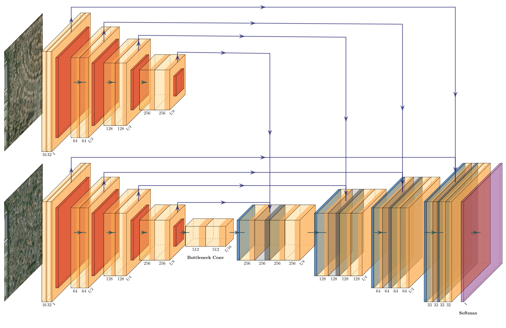

# Natural Disaster Geospatial Damage Assessment
#### DAEN 690 Spring 2020 
#### Billy Ermlick, Nick Newman, Devayani Pawar, Tyler Richardett 

-----

## Project Description
When a natural disaster occurs, damaged regions rely on timely damage assessments to receive relief. Currently, this is a slow and laborious process, during which groups such as the Federal Emergency Management Agency (FEMA) conduct on-the-ground evaluations to form fiscal estimates. This project attempts to expedite relief efforts by applying computer vision algorithms to satellite images to quickly and accurately estimate physical and fiscal damage caused by natural disasters. The data used for this analysis consists of satellite images from six types of natural disasters gathered from the xBD dataset provided by the Defense Innovation Unit. Modeling efforts include the use of connected UNets and Mask RCNN for building localization and damage classification, with a pixel-based financial model capable of outputting financial costs according to the United States National Grid (USNG) coordinate system. A proof of concept web application is presented to summarize the results of the analysis. This application provides an efficient method for fiscal evaluation and can enable aid to be rapidly provided to areas in need.

Data: https://xview2.org/

## Application Demo:
Estimated financial cost of damage caused by a natural disaster is provided above according to USNG coordinates. Top left image is an image of a disaster area before a disaster, top right image is the image of the same area after the disaster. Bottom left image is the damage predicted by the CV model. Bottom right is an animation of the financial cost of the damage on a pixel-by-pixel level according to the United States National Grid coordinate system.
<table >
  <tr>
    <td align="center" valign="center">
    <b>Before Image</b> 
    <br/>
    
    </td>
    <td align="center" valign="center">
    <b>After Image</b> 
    <br/>
    
    </td>
  </tr>
  <tr>
    <td align="center" valign="center">
    
    <br/>
    <b>Damage Estimate Prediction</b> 
    </td>
    <td align="center" valign="center">
    
    <br/>
    <b>Financial Cost Application</b> 
    </td>
  </tr>
</table>

A full video of the application is found in [/Documentation/Media/ApplicationVideo.mp4](/Documentation/Media/ApplicationVideo.mp4). The process works by uploading a satellite image of a location before and after a disaster. The user will also input the latitude and longitude of the corners of the image and submit this input. A computer vision algorithm will run and detect building locations and damage level on a scale from 0-3 (no damage, minor, major, distroyed) for each pixel in the images. These pixel values will then be utilized to plot damage costs according to the United States National Grid in an interactive application. Further details can be found in [/Documentation/](/Documentation/). 

Application is currently hosted here: <http://test-env.eba-6qua3x4j.us-east-1.elasticbeanstalk.com/>

## Xview2 Large-Scale Visualization

This is a large scale visualization of a single disaster in the Xview2 dataset. A centroid based approach is taken instead of a pixel based financial model for computational purposes.

An interaction version is currently hosted here: https://ermlickw.github.io/
<div style="text-align:center">

</div>

## Folder Details: 
<details>
    <summary> <b>Application</b> </summary>

### Setup Instructions:
A docker-compose file is provided to run the application. 
Simply install [Docker](https://www.docker.com/), cd into ./Application and run: 

```docker-compose build``` <br/>
```docker-compose up```

Open http://127.0.0.1:5000/ to view application.

### **Description of contents:** 
* santa -> demo images
- server-conf -> nginx and supervisor configurations
- src -> source files
    - dmgmodel -> files needed from MVP model (xview2unet) to run damage inference
    - static -> static files for website and user uploads
    - templates -> jinja style template for website
    - server.py -> runs the application on local host
    - wsgi.py -> runs the application through nginx/supervisor when deploying to AWS Beanstalk
    - mgrsplotter.py -> our USNG plotting function
    - damageassessment.py -> performs damage assessment on images using MVP model
    - polygonhelper.py -> helper functions for financial analysis
    - costplotting.py -> financial analysis main function
- requirements.txt -> libraries required
- Dockerfile
- docker-compose.yml 


### AWS Beanstalk deployment instructions:
- cd into ./Application
- zip all files in this directory into a single file (do not include parent /Application directory in this zip file)
- create Beanstalk environment 
    - Works for sure on t3a.small instance and add 15gig SSD memory
    - turn off their nginx default proxy server under "Software" category
- deploy -> may take up to 15min or so for deployment

### Other notes:
- line 38 of costplotter enables multithreading. Be weary rasing this above 1 if on AWS, t2 instances only have 1 thread per core. On a basic 4 core, 8 thread machine changing this line to 3 seems to work best.
- To find lat/lons for particular images in the Xview2 dataset that you would like to test out you can use the file in Exploration/modules/imagelatlons.ipynb. That will output the NW/SW/NE/SE corners of any image
- Currently the application only looks up the zip code information from our populated metadata table in ./Exploration/artifacts/polygon_meta.csv in line 129. This will work locally with the current file structure for all Xview2 images. For deployment this file is not yet included and a default 250$/sqft value is used.

</details>
<details>
    <summary> <b>Data</b> </summary>

    Data from Xview2 competition should be placed here. 
    download via -> https://xview2.org/dataset

    Other folders are used in the baseline solution.


</details>
<details>
    <summary> <b>Nick Model</b> </summary>

In house model attempt at the Xview2 challenge. View folder for more information.

**The Dual Image U-Net Architecture:**


## Instructions:
**Download the data from:**
- https://xview2.org/dataset

**Run transform_data.sh** 
- To consolidate the training and tier 3 data and the testing and holdout data into train and test directories, respectively

**Run data_preprocessing.py**
- Reads the json label data and creates a ‘targets’ directory containing the pre- and post-disaster image masks

**Run train\_model.py**
- This script imports keras\_dataset.py and dual_image_unet.py to use during training.
- LabeledImageDataset takes in the pre and post images along with the post labels - make sure the pattern variable is in the right directory
- U-Net is the dual image input U-Net - make sure the number of output classes is correct (should be 5, for the different levels of damage)
- Best model weights will be saved based on the validation loss. Saved to an hdf5 file.

**Run test\_process.py**
- This script formats the test targets directory from earlier in a way that each target label is of shape (1024, 1024) and each pixel has the class label.
- It also loads in the pretrained model weights and predicts on the test images.
- These predictions are output in the same shape and format as the target labels - into the predictions directory.

**Run the final metrics calculator at:**
- https://github.com/DIUx-xView/xView2_scoring/blob/master/xview2_metrics.py
    
**Plotting_sample_images.py**
- Contains functions needed to plot the masks over the original image. This assists in visualizing the results.

    


</details>
<details>
    <summary> <b>Exploration</b> </summary>

### Description of contents: 
- artifacts -> derived data files 
    - disasters\_to\_counties.csv -> list of counties in Xview2 dataset and building count
    - disasters\_to\_countiestest.csv -> '' with estimated sqft using GSD in /modules/image_area.py
    - disasters\_to\_zip_codes.csv -> list of zip codes for each disaster in Xview 2 with building count
    - disasters.csv -> list of disasters in Xview2, dataset location, and type of disaster
    - goids.csv -> reference table for geoid,county_name,state_name (downloaded in this case)
    - images_sqm.csv -> attempt to approximate image area using GSD --rough estimate
    - MGRS.csv -> polygons for all Xview2 USNG grids --this was a first draft
    - polygons_meta/data.csv -> derived metadata information for each building
    - usaMGRS.csv -> cleaned polygons for all US grids in Xview2 data
- inputs 
    - tl\_2017-us_state -> shape file for US state boundaries to aid in Xview visualization
    - county\_names.csv -> county track names table
    - tract\_to\_zip.csv -> county track to zip table
    - zip\_median\_price...csv -> zillow 2018 seasonally adjusted price per sqft for zipcodes
- modules
    - visuals -> leaflet and xview2 visualizations - checkout summary and usngxviewviz
    - convert\_annotations\_json\_to\_tabular.py -> converts dataset json labels to csvs for exploration
    - DisasterFullMGRSAWS.ipynb -> used to plot full Xview2 financial cost visualization. Pulls image data 
    from that stored on AWS. This result is currently hosted at https://ermlickw.github.io/
    - geocode\_polygons_zip.py -> Spark job to get zip code for each building
    - geocode\_polygons.py -> Spark job to get lat/lon of centroid ofeach building and GEOID from census data API call
    - geoids\_crosswalk.py -> joining zip, county, information into polygon_metadata
    - image\_area.py -> rough estimate of each images area using GSD and multiprocessing
    - imagelatlons.ipynb -> code to determine NW/SW/NE/SE corners of any image in Xview2
    - index.html -> local code to run to view full Xview2 finanial cost visualization. obtained from - - - - *DisasterFullMGRSAWS.ipynb* after changing the image location away from AWS to local host
    - mgrs\_polygons.py -> multithreaded process to get all USNG grids of all precisions for Xview2 building centroids
    - mgrsgridpoints.py -> our USNG plotting function. This returns the polygon of any USNG of any precision. configured to run on MGRS.csv using multiprocessing
    - polygons\_leaflet.html/Rmd -> leaflet visualization of each disaster of Xview2 and building damage 
    - polygons\_leaflet.R -> assortment of functions for exploration, visualization and leaflet plot creation
    - sqm\_polygons.py -> multiprocessing for determining the squarefootage / m^2 for each building in Xview2

</details>
<details>
    <summary> <b>Xview2unet</b> </summary>

     Picked this up from another group to implement minimum viable product (MVP). We trained their model and uploaded our 
     checkpoints to the repo.  

     https://github.com/canktech/xview2unet

</details>
<details>
    <summary> <b>Mask RCNN</b> </summary>

## Notebooks
* [debug.ipynb](Mask_RCNN/samples/debug.ipynb) This file is used to understand the mask generation.

* [inspect_damage_assessment.ipynb](Mask_RCNN/samples/inspect_damage_assessment.ipynb) This notebook combines the pre- & post- images and creates damage annotations

* ([model.py](Mask_RCNN/mrcnn/model.py), [utils.py](Mask_RCNN/mrcnn/utils.py), [config.py](Mask_RCNN/mrcnn/config.py)): These files contain the  Mask R-CNN implementation.


* [test_images.ipynb](Mask_RCNN/samples/coco/test_images.ipynb). This notebook visualizes the test detection and metrics evaluation.


## Training on MS COCO

We train the initial model for building detection using the pretrained weights and use the updated weight for damage level detection.

Training code is in `samples/coco.py`. You can import this
module in Jupyter notebook (see the provided notebooks for examples) or you
can run it directly from the command line as such:

```
# Continue training a model that you had trained earlier
python3 samples/coco/coco.py train --dataset=/path/to/coco/ --model=/path/to/weights.h5

# Continue training the last model you trained. This will find
# the last trained weights in the model directory.
python3 samples/coco/coco.py train --dataset=/path/to/coco/ --model=last
```

The training schedule, learning rate, and other parameters should be set in `samples/coco.py` or mrcnn/config.py
    In house model attempt at the Xview2 challenge. - Located within Baseline folder
## Instructions:

**Download the data from:**
- https://xview2.org/dataset

**Run setup file:**
- Run python3 setup.py install

**Run annotations.py:**
- Reads the json files and converts them into coco format annotations.

**Download pre trained coco weights for initial training**

**Run coco.py for training**
- Trains Dataset.
- Hyper-Parameter tuning to improve detection.

**Run test_images to detect, validate and visualize test dataset**
- Green for no damage and Red for destruction

</details>
<details>
    <summary> <b>Baseline</b> </summary>
    These are the steps we used to set up the baseline solution running provided by the competition hosts. 
    If you desire to get their baseline solution up and running, feel free to use these notes as a supplement. <br/>
    https://github.com/DIUx-xView/xView2_baseline <br/>
    ** Data files not provided due to size, place these in the Data folder.
    
## Baseline setup example
       
        FROM ~Desktop/Workspace/school/DAEN/   (project directory)

### make data folder:

        mkdir Data

### clone in baseline repo:

        git clone https://github.com/DIUx-xView/xview2-baseline.git

### split into disasters:

        python  xview2-baseline/utils/split_into_disasters.py --input ~/Desktop/Workspace/school/DAEN/Data/train/ --output ~/Desktop/Workspace/school/Desktop/DAEN/Data/xBD/

### make masks:

        python xview2-baseline/utils/mask_polygons.py --input ~/Desktop/Workspace/school/DAEN/Data/xBD/ --single-file --border 2

### finalize data:

        bash xview2-baseline/utils/data_finalize.sh -i ~/Desktop/Workspace/school/DAEN/Data/xBD/ -x ~/Desktop/Workspace/school/DAEN/xview2-baseline/ -s 0.75

### change directories: 

        cd ~/Desktop/Workspace/school/DAEN/xview2-baseline/spacenet/src/models/

### train spacenet model: 

        python train_model.py ~/Desktop/Workspace/school/DAEN/Data/xBD/spacenet_gt/dataSet/ ~/Desktop/Workspace/school/DAEN/Data/xBD/spacenet_gt/images/ ~/Desktop/Workspace/school/DAEN/Data/xBD/spacenet_gt/labels/ -e 1 -b 3

### remove spacenet files to get read to process data:

        rm -r ~/Desktop/Workspace/school/DAEN/Data/xBD/spacenet_gt/

### make directories:

        cd ~/Desktop/Workspace/school/DAEN/Data/
        mkdir processed-data
        mkdir processed-data-csvs
        mkdir modelout
        mkdir tensorlog
        cd ~/Desktop/Workspace/school/DAEN/

### processdata before damage classificaiton model:

        python xview2-baseline/model/process_data.py --input_dir ~/Desktop/Workspace/school/DAEN/Data/xBD/ --output_dir ~/Desktop/Workspace/school/DAEN/Data/processed-data/ --output_dir_csv ~/Desktop/Workspace/school/DAEN/Data/processed-data-csvs/ --val_split_pct 0.75

**Remmber to change logs in damage model line 58 to ~/Desktop/Workspace/school/DAEN/Data/tensorlog along with other changes to damage classification.py that are saved**


### run damage classification:

        python xview2-baseline/model/damage_classification.py --train_data ~/Desktop/Workspace/school/DAEN/Data/processed-data/ --train_csv ~/Desktop/Workspace/school/DAEN/Data/processed-data-csvs/train.csv --test_data ~/Desktop/Workspace/school/DAEN/Data/processed-data/ --test_csv ~/Desktop/Workspace/school/DAEN/Data/processed-data-csvs/test.csv --model_out ~/Desktop/Workspace/school/DAEN/Data/modelout/


### make files for inference testing:

        cd ~/Desktop/Workspace/school/DAEN/xview2-baseline
        mkdir inference_testing
        cd inference_testing
        mkdir images
        mkdir outputimage
        mkdir weights
        cd ~/Desktop/Workspace/school/DAEN/xview2-baseline

- make sure you add appropriate date to each folder (prepost test image to images, localization and classificaiton weights to weights, and nothing to output image)
- I changed python interpreter in the inference bash file
- damage inference also needs correction of callback operations due to version
- also fix the inference_image_output.py to output different grey values that are more visible

### run interference on test data:

        bash ./utils/inference.sh -x ~/Desktop/Workspace/school/DAEN/xview2-baseline/ -i ~/Desktop/Workspace/school/DAEN/xview2-baseline/inference_testing/images/test_pre_00926.png -p ~/Desktop/Workspace/school/DAEN/xview2-baseline/inference_testing/images/test_post_00926.png -l ~/Desktop/Workspace/school/DAEN/xview2-baseline/inference_testing/weights/localization.h5 -c ~/Desktop/Workspace/school/DAEN/xview2-baseline/inference_testing/weights/classification.hdf5 -o ~/Desktop/Workspace/school/DAEN/xview2-baseline/inference_testing/outputimage/outputimage.png -y
</details>

----
